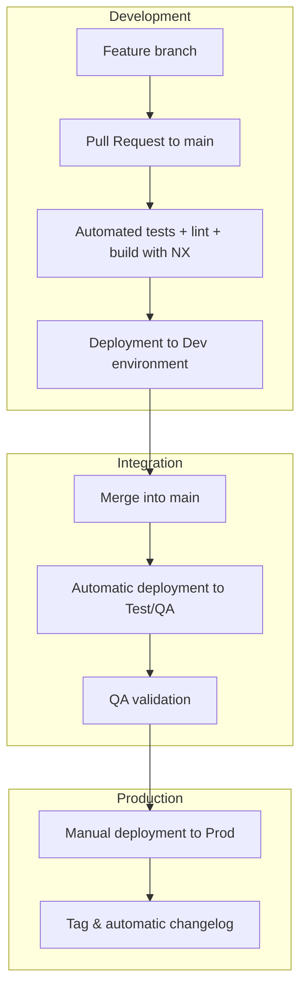

# Project Configuration

## Tech Stack

- Next.js 14+ with App Router (SPA, PWA-ready, React-based)
- Tailwind CSS and Shadcn/ui for UI components and styling
- TypeScript for all application code
- NestJS for backend API (GraphQL & REST), deployed as serverless containers
- Pnpm for package management
- Jest for tests
- Monorepo with Nx as monorepo manager and project generator
- Google Cloud Firestore for primary data store
- Google Vertex AI Search for dedicated search
- Google Cloud Pub/Sub for inter-service communication
- Google Cloud Run for backend deployment
- Pulumi (TypeScript) for infrastructure as code (IaC)
- GitHub for version control
- GitHub Actions for CI/CD
- Docusaurus for documentation

## Project Structure

my-workspace/
├── apps/ # Contains deployable applications
│ ├── webapp#1/ # Example: Your first Next.js frontend
│ ├── api#1/ # Example: Your first NestJS backend for webapp#1
│ └── webapp#2/ # Example: Another frontend or backend app
│ └── ... # Other applications (e.g., mobile, CLIs)
│
├── libs/ # Contains reusable code libraries
│ ├── shared/ # Scope: Code shared across multiple applications/domains
│ │ ├── ui/ # Type: Shared presentational components (design system?)
│ │ ├── data-access/ # Type: Shared DTOs, interfaces, client-side API logic
│ │ ├── util/ # Type: Shared utility functions, constants, helpers
│ │ └── assets/ # Type: Shared static assets (icons, images)
│ │
│ ├── webapp#1/ # Scope: Libraries specific to the 'webapp#1' application
│ │ ├── feature/ # Type: Feature modules (e.g., feature-auth, feature-profile)
│ │ ├── ui/ # Type: UI components specific to 'webapp#1'
│ │ ├── data-access/ # Type: State management, data fetching logic for 'webapp#1'
│ │ └── util/ # Type: Utilities specific to 'webapp#1'
│ │
│ ├── api#1/ # Scope: Libraries specific to the 'api#1' application
│ │ ├── feature/ # Type: Feature modules (controllers, services, logic)
│ │ ├── data-access/ # Type: Database interactions, entities, repositories
│ │ ├── core/ # Type: Core backend functionalities (auth guards, decorators)
│ │ └── util/ # Type: Utilities specific to 'api#1'
│ │
│ └── another-domain/ # Scope: Libraries related to another business domain/app
│ └── ... # Grouped by type (feature, ui, data-access, util)
│
├── tools/ # Workspace-specific tooling
│ ├── generators/ # Custom code generators for scaffolding
│ └── scripts/ # Automation scripts (build, deploy helpers, etc.)
│
├── .github/ # Standard location for GitHub Actions
│ └── workflows/ # CI/CD pipeline definitions
│
├── nx.json # Nx workspace configuration file
├── package.json # Root dependencies & workspace scripts
├── tsconfig.base.json # Base TypeScript config shared across projects
└── ... # Other root config files (eslint, prettier, jest, etc.)

## Database and Infrastructure Changes

- Firestore schema and infrastructure changes are managed via Pulumi scripts in `/infrastructure/pulumi`.
- All infrastructure changes must be reviewed by Cline before execution.

## Development Workflow

- Cline helps write and review code changes
- GitHub Actions run CI/CD, Nx manages affected builds/tests.
- Cloud Run auto-deploys the app from the main branch.
- Database and infrastructure changes (Pulumi) are reviewed by Cline before execution.

### Gitflow

The project follows a Gitflow-based branching model:

1.  **Feature Development:**
    - Create a feature branch from `main`.
    - Develop the feature and commit changes.
    - Open a Pull Request (PR) to merge the feature branch into `main`.
    - The PR triggers automated checks (linting, formatting, tests, build) via GitHub Actions.
    - Deploy to a development environment.
2.  **Integration:**
    - Once the PR is approved and checks pass, merge it into `main`.
    - Merging into `main` triggers automatic deployment to a Test/QA environment.
    - QA performs validation in the Test/QA environment.
3.  **Production:**
    - Manually trigger deployment to the Production environment from the `main` branch (or a dedicated release branch if implemented).
    - After successful deployment, create a Git tag for the release.
    - Automatically generate a changelog based on commit history.

## Security

DO NOT read or modify:

- .env files
- \*_/config/secrets._
- Any file containing API keys or credentials
- Any Google Cloud IAM/Secret Manager configuration files
