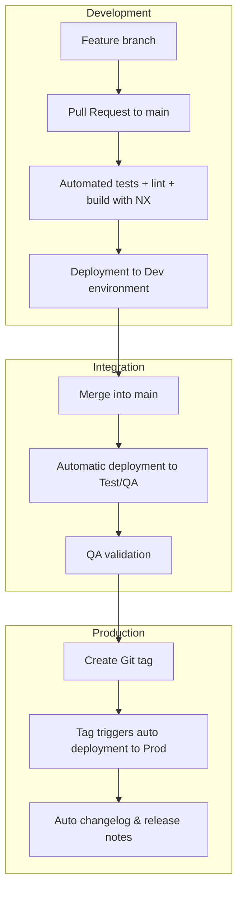

# Development Workflow

- Cline helps write and review code changes
- GitHub Actions run CI/CD, Nx manages affected builds/tests.
- Cloud Run auto-deploys the app from the main branch.
- Database and infrastructure changes (Pulumi) are reviewed by Cline before
  execution.

## Gitflow

The project follows a Gitflow-based branching model:

1. **Feature Development:**

   - Create a feature branch from `main`.
   - Develop the feature and commit changes.
   - Open a Pull Request (PR) to merge the feature branch into `main`.
   - The PR triggers automated checks (linting, formatting, tests, build) via
     GitHub Actions.
   - Deploy to a development environment for technical review.

2. **Integration:**

   - Once the PR is approved and checks pass, merge it into `main`.
   - Merging into `main` triggers automatic deployment to a Test/QA environment.
   - QA performs validation in the Test/QA environment.

3. **Production:**
   - When ready to release, create a Git tag (e.g., `v1.2.3`) on the desired
     commit in `main`.
   - Pushing the tag triggers automatic deployment to Production via CI/CD.
   - As part of the tag-triggered workflow:
     - The changelog is automatically generated based on commit history.
     - A GitHub Release (or equivalent) can be created, including release notes.

